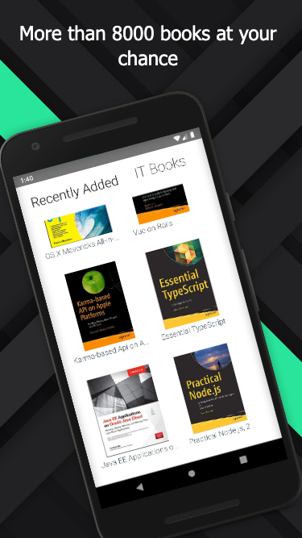

> WIP

# IT BOOKS APP

IT Books its your app for reading and searching more than 8k books about IT, in which you can save it or download them for reading after or while offline.

This app is made with this stack technology:  
- Golang (core of the app)
- Typescript
- React-Native
- Redux
- RxJS

    
    

    
    

## This app is under development so expect some changes